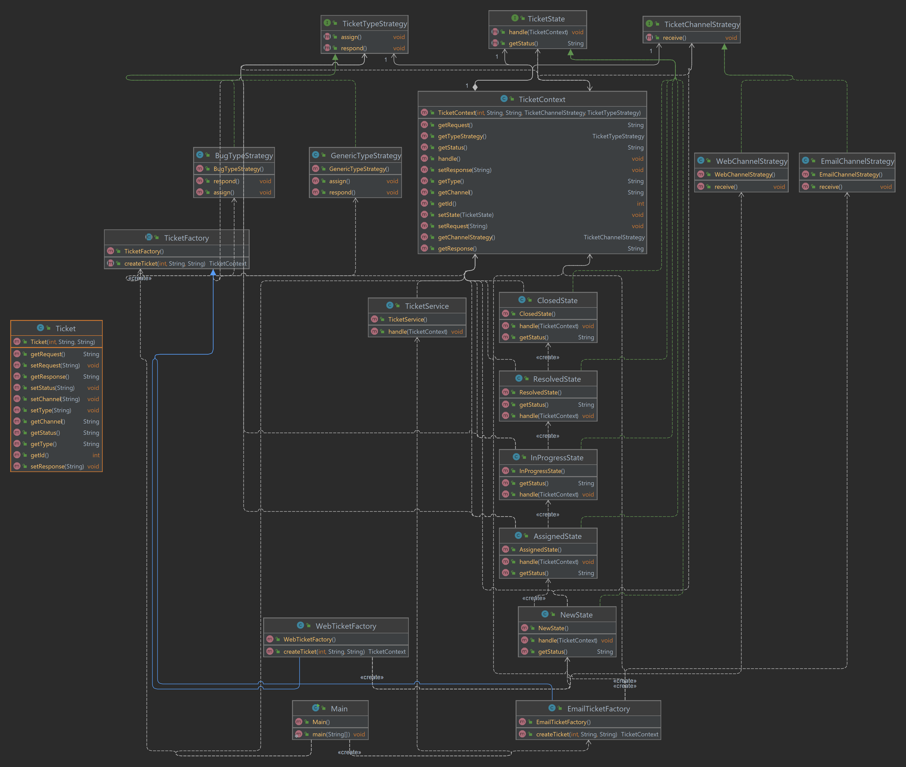

# سیستم مدیریت درخواست های پشتیبانی (ticket)
در دومین تمرین درس طراحی شی‌گرایی سیستم‌ها میخواهیم مقداری با الگوهای طراحی ارائه شده، بیشتر آشنا شویم. پس آماده باشید که ناوگان عظیمی از کد‌ها در حال حرکت به سوی شماست ، خواهیم دید چه می شود!

---
# **بخش ۱) تشخیص زیرمسائل و الگوها**

در بررسی کد ارائه‌شده مشاهده می‌شود که سیستم مدیریت تیکت، علی‌رغم عملکرد صحیح، از نظر طراحی شی‌گرا بسیار ضعیف است و تقریباً تمام منطق‌ها در شرط‌های بزرگ و تکراری نوشته شده‌اند. با توجه به توضیحات مسئله و کد موجود، سه زیرمسئله اصلی شناسایی شدند که هر کدام نیازمند یک الگوی طراحی خاص هستند. در ادامه هر زیرمسئله را به طور مختصر شرح می‌دهم، الگوی مناسب را با دلیل پیشنهاد می‌کنیم و روش اعمال آن را بیان می‌کنیم.

## **زیرمسئله اول: رفتار وابسته به حالت**
هر تیکت در طول عمر خود پنج وضعیت متوالی (`NEW`، `ASSIGNED`، `IN_PROGRESS`، `RESOLVED`، `CLOSED`) را طی می‌کند و رفتار سیستم در هر وضعیت کاملاً متفاوت است. در کد فعلی، تمام این رفتارها داخل متد `handle()` کلاس `TicketService` با پنج `if` جداگانه روی متغیر `currentStatus` پیاده‌سازی شده است. این ساختار باعث شده که اضافه کردن وضعیت جدید یا تغییر رفتار یک وضعیت، نیازمند ویرایش مستقیم این متد بزرگ باشد.

*   **الگوی مناسب:** `State`
*   **دلیل:** این الگو دقیقاً برای حذف شرط‌های بزرگ وابسته به حالت طراحی شده و امکان افزودن وضعیت جدید بدون تغییر کد موجود را فراهم می‌کند (رعایت اصل `OCP` و `SRP`).
*   **روش اعمال:** یک اینترفیس به نام `TicketState` ایجاد می‌کنیم که متد `handle(TicketContext context)` را تعریف کند. سپس پنج کلاس مجزا (`NewState`، `AssignedState`، `InProgressState`، `ResolvedState`، `ClosedState`) می‌سازیم که هر کدام فقط رفتار مربوط به وضعیت خود را پیاده‌سازی کنند. کلاس `Ticket` را به `TicketContext` تبدیل کرده و یک فیلد `currentState` از نوع `TicketState` به آن اضافه می‌کنیم. تمام متدهای تغییر وضعیت در `Context` فقط `currentState.handle(this)` را فراخوانی می‌کنند و تغییر وضعیت با متد `setState()` انجام می‌شود.

## **زیرمسئله دوم: پردازش و پاسخ‌دهی متفاوت بر اساس کانال و نوع تیکت**
رفتار دریافت تیکت، تخصیص تیم، تولید پاسخ و حتی متن‌های چاپی برای کانال‌های `WEB`و`EMAIL` و انواع `BUG` و غیر`BUG` کاملاً متفاوت است. این تفاوت‌ها در کلاس `TicketService` به صورت `if-else`های پراکنده پخش شده. در نتیجه افزودن کانال یا نوع جدید نیازمند تغییر چندین نقطه از کد است.

*   **الگوی مناسب:** `Strategy`
*   **دلیل:** این الگو برای قابل تعویض کردن خانواده‌ای از الگوریتم‌ها (اینجا پردازش بر اساس کانال و نوع) بسیار مناسب است و امکان افزودن رفتار جدید بدون تغییر کلاس اصلی را می‌دهد.
*   **روش اعمال:** دو اینترفیس جداگانه تعریف می‌کنیم: `TicketChannelStrategy` (برای رفتارهای مرتبط با کانال) و `TicketTypeStrategy` (برای رفتارهای مرتبط با نوع). سپس کلاس‌های `WebChannelStrategy`، `EmailChannelStrategy`، `BugTypeStrategy` و `GenericTypeStrategy` را پیاده‌سازی می‌کنیم. در `TicketContext` دو فیلد از این دو استراتژی نگه می‌داریم و متد `handle()` فقط متدهای مربوطه را روی استراتژی‌های فعلی فراخوانی می‌کند. این دو استراتژی موقع ساخت تیکت (در کارخانه) تزریق می‌شوند.

## **زیرمسئله سوم: ایجاد آبجکت تیکت پیچیده به صورت مرحله‌به‌مرحله**
ساخت هر تیکت جدید نیازمند تنظیم همزمان `id`، کانال، نوع، وضعیت اولیه (همیشه `NEW`)، تزریق استراتژی‌ها و ثبت لاگ اولیه است. در کد فعلی این کار به صورت دستی و پراکنده در سازنده `Ticket` و متد `handle()` انجام می‌شود (در `Ticket.java` و `TicketService.java`). افزودن کانال یا نوع جدید نیازمند تغییر سازنده و `Main` است.

*   **الگوی مناسب:** `Factory Method`
*   **دلیل:** این الگو ایجاد آبجکت‌های پیچیده را بدون اینکه کلاینت از جزئیات ساخت آگاه باشد، متمرکز می‌کند و امکان گسترش آسان را فراهم می‌آورد.
*   **روش اعمال:** یک کلاس abstract به نام `TicketFactory` با متد `abstract createTicket(int id, String channel, String type)` می‌سازیم. سپس دو زیرکلاس `WebTicketFactory` و `EmailTicketFactory` ایجاد می‌کنیم که در متد `createTicket` ابتدا یک `TicketContext` می‌سازند، وضعیت اولیه را `NewState` قرار می‌دهند، استراتژی‌های کانال و نوع مناسب را تزریق می‌کنند، لاگ اولیه را ثبت می‌کنند و در نهایت شیء را برمی‌گردانند. در `Main` فقط کافی است کارخانه مناسب را فراخوانی کنیم.
---

# **بخش ۲) ترسیم Class Diagram**
در این بخش مطابق راه‌حلی که در بخش گذشته برای بهبود کد ارائه دادیم ، یک دیاگرام کلاس ترسیم می کنیم.

در این دیاگرام سه الگوی `State`، `Strategy` و `Factory` مشخص‌اند: `TicketContext` نقش `Context` را دارد و با نگه داشتن `currentState` از نوع `TicketState` رفتار هر وضعیت را به کلاس‌های جدا (`NewState` تا `ClosedState`) واگذار می‌کند و هر State وضعیت بعدی را تعیین می‌کند. رفتارهای وابسته به کانال و نوع با دو اینترفیس `TicketChannelStrategy` و `TicketTypeStrategy` و پیاده‌سازی‌هایشان جدا شده‌اند تا تغییرپذیر باشند و ساخت شیء تیکت به‌همراه تنظیم وضعیت اولیه و تزریق استراتژی‌ها در `TicketFactory` و کارخانه‌های `Web/Email` انجام می‌شود تا منطق ایجاد از بقیه کد جدا بماند.

---
# **بخش ۳) اعمال الگو ها**
در این بخش نیز الگو‌های `Factory`,`Strategy`,`State` که در بخش اول بیان شده اند را پیاده‌سازی می کنیم. کد مربوط به الگو ها در پوشه Ticketing موجود هستند.

---

# **بخش ۴) تحلیل شی‌گرا**

پس از اعمال الگوهای طراحی، سیستم از منظر اصول شی‌گرایی بهبود یافته است. اصل SRP با جداسازی مسئولیت‌ها در کلاس‌های مجزا برای هر State و Strategy رعایت شده و دیگر یک کلاس چندین دلیل برای تغییر ندارد. اصل OCP نیز به طور کامل اعمال شده است زیرا برای افزودن کانال یا نوع پاسخ جدید فقط کافی است یک کلاس جدید ایجاد کنیم بدون اینکه کد موجود تغییر کند، در حالی که قبلا باید زنجیره if-else را تغییر می‌دادیم. از نظر DIP نیز وابستگی‌ها معکوس شده و کلاس Ticket به جای وابستگی مستقیم به String ها یا پیاده‌سازی‌های مشخص، به interface ها وابسته است. همچنین اصل CRP با قرار دادن کلاس‌های مرتبط در package های مجزا رعایت شده و هر package یک مسئولیت واحد دارد. در مجموع، سیستم بازطراحی شده از نظر نگهداری‌پذیری، توسعه‌پذیری و تست‌پذیری به مراتب بهتر از نسخه قبلی است و تمام اصول شی‌گرایی در آن رعایت شده است.

---

## 🧩 نکات پایانی

در کارگه کوزه‌گری رفتم دوش

دیدم دو هزار کوزه گویا و خموش

ناگاه یکی کوزه برآورد خروش

کو کوزه‌گر و کوزه‌خر و کوزه فروش!

https://ganjoor.net/khayyam/robaee/sh117
